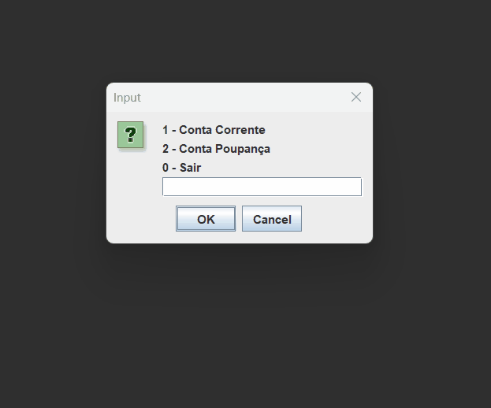

# Projeto Acadêmico - Herança em Java

Este repositório contém um projeto acadêmico desenvolvido em Java, utilizando o Eclipse IDE, com o objetivo de demonstrar os conceitos de **Herança** e **Polimorfismo**.

## Estrutura do Projeto
- **model**
  - `Conta.java`
  - `ContaCorrente.java`
  - `ContaPoupanca.java`
- **view**
  - `Principal.java`

## Objetivos
- Aplicar os princípios de herança entre classes.
- Implementar operações básicas de contas bancárias (depósito e saque).
- Demonstrar polimorfismo em cenários práticos.

## Demonstração

## Tecnologias Utilizadas
- Java 21
- Eclipse IDE
- GitHub para versionamento

---
